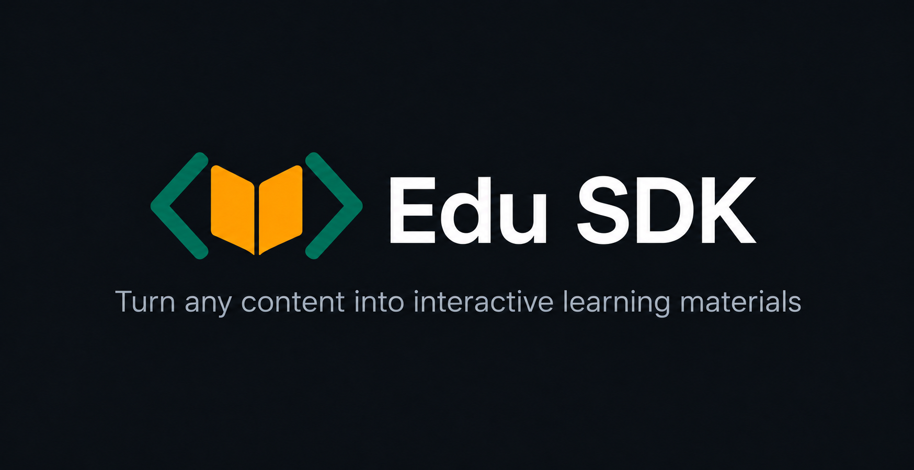

<p align="center">
  
</p>

# Edu SDK

**Turn any content into interactive learning surfaces.**

The TypeScript SDK for AI-powered learning. Generate quizzes, flashcards, study guides, practice problems, and notes from content—then render them with React.

## Packages

| Package | Description |
| --- | --- |
| [`edu-sdk`](./packages/core) | Generate learning materials from content |
| [`@edu-sdk/react`](./packages/react) | React components for those materials |

## Install

Generation only:

```bash
pnpm add edu-sdk
```

Generation + UI (includes `edu-sdk`):

```bash
pnpm add @edu-sdk/react
```

## Quick example

```ts
import { createQuiz } from "edu-sdk";
import { Quiz } from "@edu-sdk/react";
import "@edu-sdk/react/styles.css";

const quiz = await createQuiz({
  model: "google/gemini-3.6-flash",
  content,
  count: 10,
  difficulty: "medium",
});

<Quiz questions={quiz.content} />;
```

## Monorepo

```text
edu-sdk/
├── packages/
│   ├── core/      # edu-sdk
│   └── react/     # @edu-sdk/react
└── apps/
    ├── web/       # docs + marketing site
    └── playground/
```

## Develop

```bash
pnpm install
pnpm build
pnpm test
pnpm dev:web
```

## Links

- Docs: run `pnpm dev:web` and open the local site
- GitHub: [klawrodev/edu-sdk](https://github.com/klawrodev/edu-sdk)
- Package docs: [`edu-sdk`](./packages/core/README.md) · [`@edu-sdk/react`](./packages/react/README.md)
- [Contributing](./CONTRIBUTING.md)

## License

MIT © 2026 Oluwatobiloba Adejumo. See [LICENSE](./LICENSE).
